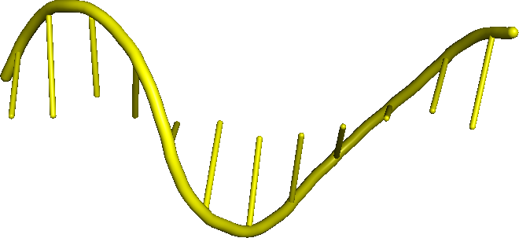
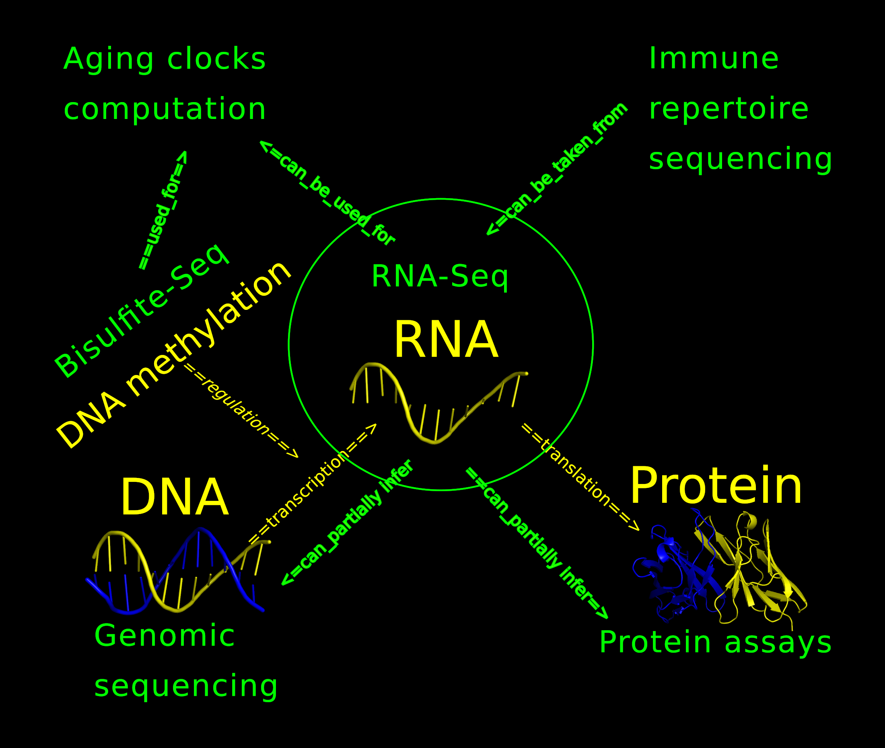

# Just DNA-Seq #

DNA-Seq pipeline with longevity gene variants annotation plugin

## Who are we? ##

Our team is formed of a mix of multi-disciplinary scientists with strong expertise in bioinformatics, systems biology, genetics and molecular cell biology. The group is involved in both academic and industry activities. Academic projects in the field of aging-research are generally carried out by our team as part of the Systems Biology of Aging Group (www.aging-research.group) at the Institute of Biochemistry of the Romanian Academy. More entrepreneurial projects are implemented within a spin-off company, CellFabrik (www.cellfabrik.bio).  
The group's expertise includes analysis of transcriptomics [1][2], single-cell RNA sequencing [2], machine learning [1][3], and aging biology[4][5].

## What is RNA health? ##

### Sequencing and health ###

In biology there are multiple types of sequencing that reveal different health aspects, for example:
* Genomics sequencing can tell about your hereditary health and some risks.
* Methylation (bisulfite) sequencing shows epigenetic states of the cells and can also be useful for measuring your biological age
* Adaptive immune repertoire sequencing (AIRR-Seq) can show which antibodies and t-cell receptors your immune cells produce in response to bacterial, viral, autologous and other antigens
* Proteomic assays (SomaScan and others) show current state of some organs but provide no hereditary info
* Etc.

### RNA sequencing ###

In comparison with other types of sequencing, RNA-Seq is the "Jack of all trades but master of none". It can partially substitute other sequencing types:
* RNA variant-calling can tell about coding genetic variations in your genome [6]
* RNA quantification can tell about the protein content and cell types proportions (cell types deconvolution) in the blood and can also be used to compare different conditions (differential expression)
* Adaptive immune repertoire (antibodies and T cell receptors) can be reconstructed from a subset of RNA [7]
* Aging clock can also be computed from gene expressions [8]

In the same time, doing multiple sequencing on yourself or your pets can be prohibitively expensive while blood RNA-Seq is relatively cheap and can be useful for multiple purposes and can also integrate with other types of sequencing. This makes RNA-Seq promising tool for quick health exploration or refinement of information from other sequencing modalities.

### Goals of the project ###

The goal of this project is to provide an opensource toolbox that will allow:
* RNA age prediction [8] which involves training RNA aging clock on available public datasets as well as integrating known clocks like BitAge [8]
* Inferring coding genes variations relevant for the health and providing polygenic scores for diseases (collaboration with Just-DNA-Seq project)
* Extraction of adaptive immune repertoires from RNA-Seq data and generating adaptive immune report. Processing of public RNA-Seq data of different
* Refinement of genetic variations extracted from DNA-Seq with RNA-Seq data (collaboration with Just-DNA-Seq project)
* Privacy-preserving storage and analysis of your personal RNA-Seq (collaboration with Genomes-DAO)
* Integrating the pipelines with Lab DAO ecosystem that will allow everybody run them online

## Why a Gitcoin Grant? ##

This Gitcoin grant will be used to fund and speed up the development of the project. Often, when research code is written there is a lack of incentive to turn it from just an executable supplement of the academic papers to a library and a toolbox that everybody can use benefit from. Gitcoin funding will allow us to turn our previous research pipelines in an extensible opensource toolbox that other researchers, citizen scientist and quantify-self enthusiasts can use, extend and apply both to their personal data or datasets of their interest.

## Other ways to help us ##

If you have programming skills you can help with the development
If you have biological skills you can help with prioritising genes in genetic reports and literature curation
If you are analysing your data you can always provide feedback on what should be improved