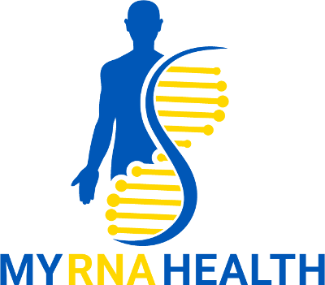
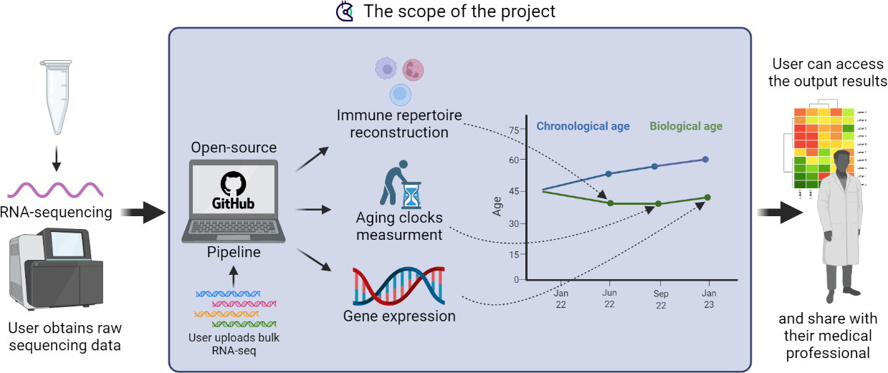

# Just DNA-Seq #

DNA-Seq pipeline with longevity gene variants annotation plugin

## What is RNA-Health ##

RNA sequencing (RNA-Seq) provides information both about our genetics, specifically genetic variations in the coding genes, as well as about the current state of the organism, providing insights into various aspects such as the immune system function and aging. Technologically, it requires a smaller number of sequencing reads and can potentially be performed in a more cost-effective way than the more popular DNA or methylation (bisulfite) sequencing.
Our project is devoted to unleashing the potential of RNA-Seq by providing open-source tools and web services for analyzing your personal RNA-Seq, with an emphasis on aging and health-related observations. Results include gene expression quantification, detection of mutations in coding genes, transcriptomic aging clock computation for estimating the pace of aging, and reconstruction of the adaptive immune repertoire (AIRR) from immune cells to get hints on adaptive immunity.
We will also aim for the RNA-Health tools to be flexible to the depth of RNA-Seq, and as such, we will conduct in silico experiments to evaluate the dependency of results’ accuracy on the number of RNA-Seq reads. Based on these assays, we will deliver a guideline for the required size and quality of the input data - allowing for cheap and affordable personalized RNA sequencing. We think that this issue is especially important, as an aging clock might be measured several times per year and costs could significantly accumulate throughout the lifetime.
If funding allows, the project will also include integration of RNA sequencing results into the Web3 ecosystem, allowing users to protect and manage their own personal data (including sharing, selling, etc).

## Who are we? ##
Our team is formed of a mix of multi-disciplinary scientists with strong expertise in bioinformatics, systems biology, genetics and molecular cell biology. The group is involved in both academic and industry activities. Academic projects in the field of aging research are generally carried out by our team as part of the Systems Biology of Aging Group (www.aging-research.group) at the Institute of Biochemistry of the Romanian Academy. More entrepreneurial projects are implemented within a spin-off company, CellFabrik (www.cellfabrik.bio). 
The group has expertise in transcriptomics [1-3], single-cell RNA sequencing [2], machine learning [1,4], and aging biology [5,6].

## Team members: ##

Robi Tacutu, PhD https://github.com/robi-tacutu bioinformatician and group leader
Anton Kulaga https://github.com/antonkulaga bioinformatician and software developer
Eugen Ursu, MD https://github.com/ursueugen  bioinformatician and software developer
Dmitri Toren, PhD https://github.com/MityaToren  molecular biologist
Ioan Matei, MD, PhD https://github.com/ivmatei molecular biologist

## Sequencing and health ##
Until recently, only genomic (DNA) sequencing was widely available for personal use. The main reasons for this were a better understanding of genomics (as opposed to transcriptomics) by the general public and the simple, readily accessible required biological samples (saliva). With advances in aging research, bisulfite (methylation) sequencing has also become popular due to numerous “clocks'' [6,7] that allow measuring the pace of aging in an individual. At the same time, other sequencing types like RNA-Seq and adaptive immune repertoire sequencing (AIRR-Seq) - which can also be inferred based on RNA-Seq, remained limited mostly to academia and big pharma. One of the major hurdles to expanding their usage has been the reliance on blood samples that need medical personnel for harvesting and downstream processing. Recently, however,  the emergence of personal blood harvesting with RNA-fixation [9] has paved the way for novel personalized RNA-Seq diagnostics.

## Role of RNA and its sequencing ##
The so-called “central dogma of molecular biology” describes the major processes happening in all living organisms:  transcribing DNA to RNA and translating RNA to proteins. As such, RNA is at the intersection of two worlds: heredity (DNA), as well as phenotype (proteins), and can be used to infer [11] or validate part of our genetic variations, to get insights into cellular states, as well as to infer cell-type composition. Adaptive immune repertoire data can also be reconstructed from regular RNA-Seq [12].

## Why a Gitcoin Grant? ##

Our lab is committed to the values of open-source and open-science, and wants to enable longevity enthusiasts and citizen scientists to use our academic work. In particular, our RNA-Seq bioinformatic pipelines have been developed in an open source way from the very beginning.
Now, we want to develop additional features enabling people outside of academia and with limited biomedical knowledge to benefit from our research and developments. This type of effort is encouraged less by academic funding, which emphasizes publications rather than source-code quality and easy-to-use API. Also, as the code is open and free, it is not particularly appealing for attracting industrial funding. For these reasons, we consider the Longevity round of Gitcoin to be the ideal choice for this type of project.

## Development goals ##

In particular, we want to develop an open-source toolbox that will allow:
* User-friendly interface for analysis pipelines: running our pipelines in an easier way (currently, they require direct interactions with Cromwell execution server and/or CromwellClient) and deploying them as web apps
* RNA-based age prediction: integrating known clocks such as BitAge [10] and potentially developing other clocks
* Coding gene variations inference such as indels and gene fusions, and alternative transcripts
* Adaptive immune repertoires reconstruction from RNA-Seq data and generation of adaptive immune reports

If funding will allow, we also want to reach several “stretch goals”. In particular, if both direct donations and GR13 round matching (which can result in 4-7 times more than direct donations) will provide us with >30,000$, we will work on:
* Refinement of genetic variations extracted from DNA-Seq with RNA-Seq data (will be done in collaboration with Just-DNA-Seq Gitcoin project)
* Additional downstream analyses based on RNA-Seq data (e.g. gene expression trajectory for multiple time points)
* Integrating with the Web3 ecosystem (e.g. Lab DAO) to run the tools developed in this project

If we manage to collect >60,000$ in donations and Gitcoin matching, we will also focus on the following important issues:
* Having a pilot study with a small cohort of people, potentially using personal blood-harvesting devices, in order to improve methodology, validate the aging-transcriptome clock and decrease costs.
* Apply developments from previous goals in order to do auxiliary data analysis for cancer RNA-Seq samples. RNA-based analysis has proven informative in the research of cancer -  which is one of the main obstacles towards extending lifespan. Cancer RNA-Seq analysis is not available everywhere, is highly overpriced, and can sometimes be outdated, as companies are wary of patent disputes, and of showing potentially valuable, but clinically unvalidated novel discoveries. We will provide an option for patients and patient organizations to obtain additional insights from RNA-Seq that supports the efforts for diagnostics and therapy by licensed medical professionals. As the code will be totally open, the responsibilities of judging the results will be moved to medical professionals working directly with cancer patients and patient organizations who will use it. Nevertheless, we believe that making these tools publicly available, even with such disclaimers, could benefit the general public.

# How to donate #

For newcomers to crypto donating can be associated with multiple pitfalls. 
Our lab wrote this [pdf guide](https://github.com/my-rna-health/rna-seq/raw/gh-pages/gitcoin_how_to_donate.pdf) on how to donate to Gitcoin projects.

## Other ways to help us: ##

* If you have programming skills you can help with the development
* If you have biological skills you can help with prioritizing genes in genetic reports and literature curation
* If you are analyzing your data you can always provide feedback on what should be improved
* If you are a clinics of sequencing facility you can partner with us

## References: ##

1. Kulaga, A. Y., Ursu, E., Toren, D., Tyshchenko, V., Guinea, R., Pushkova, M., ... & Tacutu, R. (2021). Machine learning analysis of longevity-associated gene expression landscapes in mammals. International journal of molecular sciences, 22(3), 1073. [https://doi.org/10.3390/ijms22031073](https://doi.org/10.3390/ijms22031073)
2. Lagger, C., Ursu, E., Equey, A., Avelar, R. A., Pisco, A. O., Tacutu, R., & de Magalhães, J. P. (2021). scAgeCom: a murine atlas of age-related changes in intercellular communication inferred with the package scDiffCom. bioRxiv.
3. Toren D, Kulaga A, Jethva M, Rubin E, Snezhkina AV, Kudryavtseva AV, Nowicki D, Tacutu R, Moskalev AA, Fraifeld VE. Gray whale transcriptome reveals longevity adaptations associated with DNA repair and ubiquitination. Aging Cell. 2020 Jul;19(7):e13158. [https://doi.org/10.1111/acel.13158](https://doi.org/10.1111/acel.13158)
4. Learning flat representations with artificial neural networks V Constantinescu, C Chiru, T Boloni, A Florea… - Applied Intelligence, 2021
5. Bunu, Gabriela, et al. "SynergyAge, a curated database for synergistic and antagonistic interactions of longevity-associated genes." Scientific data 7.1 (2020): 1-11.
6. Tacutu, Robi, et al. "Human aging genomic resources: new and updated databases." Nucleic acids research 46.D1 (2018): D1083-D1090.
7. Lu, Ake T., et al. "DNA methylation GrimAge strongly predicts lifespan and healthspan." Aging (Albany NY) 11.2 (2019): 303. [https://doi.org/10.18632/aging.101684](https://doi.org/10.18632/aging.101684)
8. Noroozi, Rezvan, et al. "DNA methylation-based age clocks: from age prediction to age reversion." aging Research Reviews 68 (2021): 101314. [https://doi.org/10.1016/j.arr.2021.101314](https://doi.org/10.1016/j.arr.2021.101314)
9. Haack, Amanda J., et al. "home RNA: A self-sampling kit for the collection of peripheral blood and stabilization of RNA." Analytical Chemistry 93.39 (2021): 13196-13203. [https://pubs.acs.org/doi/abs/10.1021/acs.analchem.1c02008](https://pubs.acs.org/doi/abs/10.1021/acs.analchem.1c02008)
10. Meyer, David H., and Björn Schumacher. "BiT age: A transcriptome‐based aging clock near the theoretical limit of accuracy." Aging cell 20.3 (2021): e13320. [https://doi.org/10.1111/acel.13320](https://doi.org/10.1111/acel.13320)
11. Zhao, Yun, et al. "A high-throughput SNP discovery strategy for RNA-seq data." BMC genomics 20.1 (2019): 1-10. [https://doi.org/10.1186/s12864-019-5533-4](https://doi.org/10.1186/s12864-019-5533-4)
12. Song, Li, et al. "TRUST4: immune repertoire reconstruction from bulk and single-cell RNA-seq data." Nature Methods 18.6 (2021): 627-630 [https://doi.org/10.1038/s41592-021-01142-2](https://doi.org/10.1038/s41592-021-01142-2)